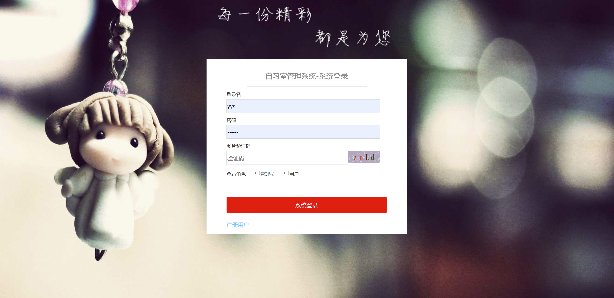
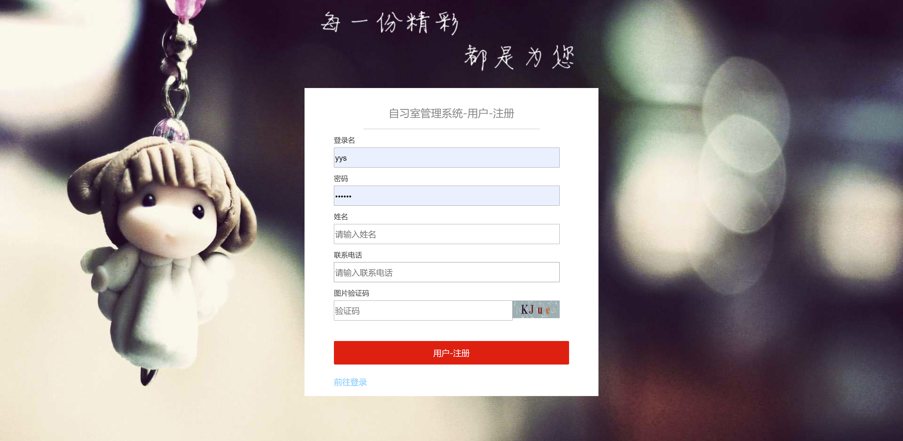
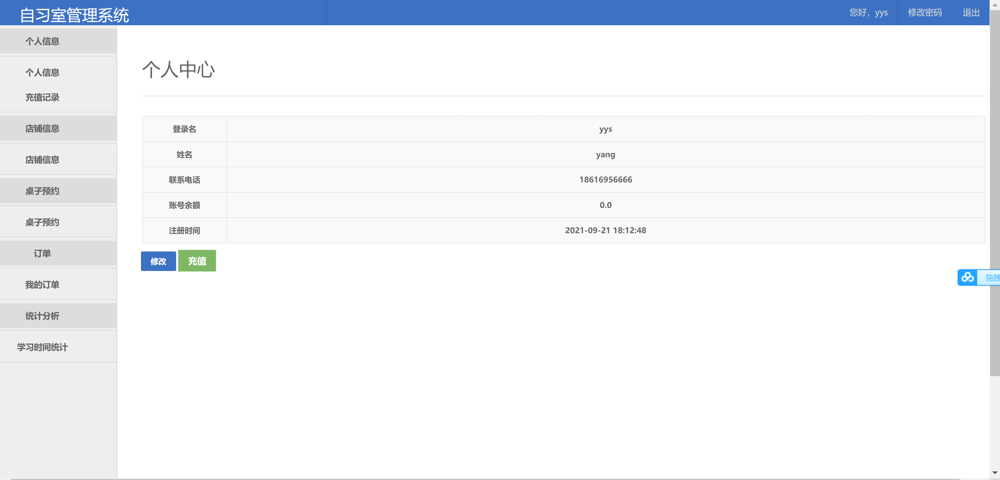
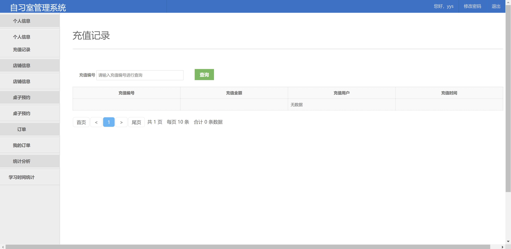

<h1 align="center">自习室管理系统</h1>

## 简介
自习室管理系统：角色分为管理员、用户；功能包含个人信息管理、桌子预约、充值记录查询、订单管理、统计分析和学习时间统计。系统提高预约和管理效率。    --计算机毕业设计源码；毕设源码；java毕业设计源码

## 联系方式

<h3 align="center">获取完整代码与数据库文件 + 微信：deepguan QQ: 86050149 QQ群: 783742310</h3>

<h3 align="center">可帮忙远程部署 包运行成功！提供远程部署、修改代码、设计文档指导、代码讲解等服务！</h3>

## 功能介绍（完整见运行截图）
管理员：管理员可通过登录界面进入后台管理系统，设置自习室开放时间、管理用户权限、生成使用报告，并查看与管理用户的预约历史。前台则提供各模块的综合统计分析，便于提升自习室的使用效率和管理便利性。

用户：用户在个人中心可查看和修改个人信息，查询订单和预约记录，并查看学习时间统计。在自习室管理模块中，用户可以预约桌位、查看空闲座位、自主取消预约，使得预约操作简便高效。个人界面提供充值功能以维持账户余额。

## 运行截图

本代码来源于网络,仅供学习参考使用!

